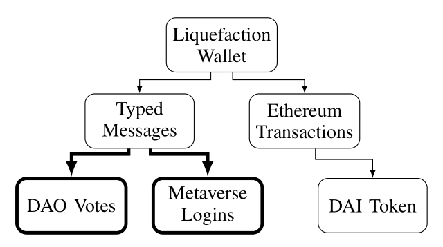
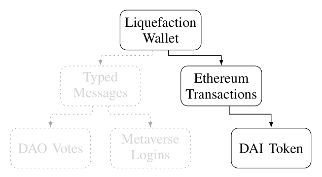
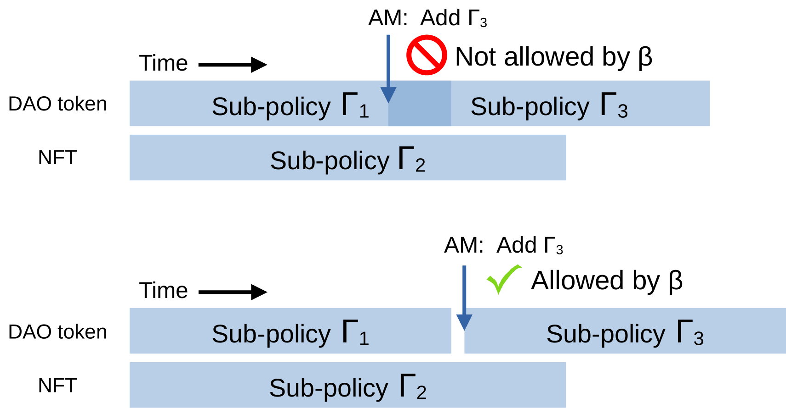
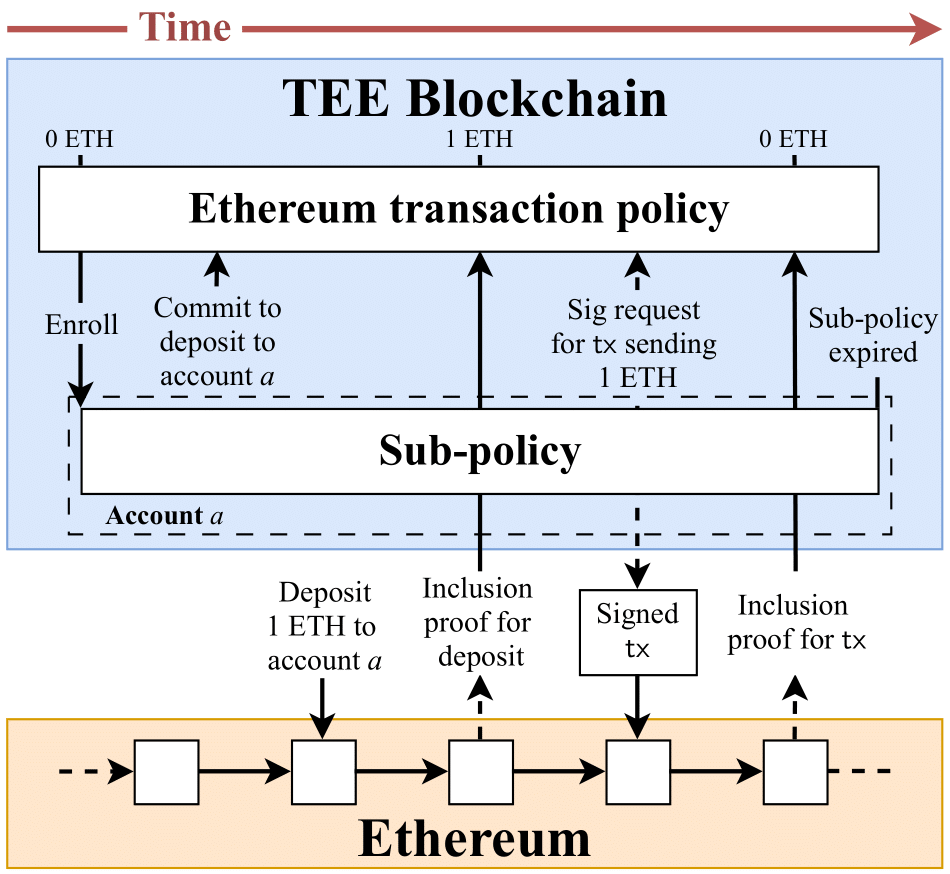

## Encumbrance policies in Liquefaction

This implementation demonstrates the **encumbrance policy** framework described in [Section 4 of the Liquefaction paper](https://arxiv.org/pdf/2412.02634#section.4). The system manages access-control policies for blockchain assets entirely off-chain.

### How does our encumbered wallet work?

- The **Access Manager**, which can be a regular EOA or a smart contract, grants access to assets or other message types. The access manager has no access to signatures by default.
- The rules that specify the key usage, called **policies**, allow for flexible sharing, delegation, and time-bound access to blockchain assets. For instance, you could permit someone to sign specific EIP-712 messages from your wallet while forbidding them from signing Ethereum transactions. Access can be delegated further using another encumbrance policy contract, called a sub-policy.

- Each policy (and sub-policy) has an expiration time after which it loses it signing access. The access manager is then allowed to give new access to the assets previously controlled by the expired policy.

 

- No two policies can have access to the same asset at the same time.

 

### Ethereum transaction policy

Fungible assets, like ether, need to be handled in a special way. We divide an encumbered account's ether into sub-balances, one for each sub-policy.

The `EthTransactionPolicy` policy contract implements this and ensures encumbrance policies can sign transactions from the same encumbered account without interfering with one another:

1. Sub-policies under this policy cannot deny service to one another.
2. Sub-policies under this policy cannot spend funds intended for another sub-policy.
3. Additional TEE blockchain transaction costs for signing transactions are minimized.
4. Sub-policy access expires as specified by AM during sub-policy creation.

See [Section 4.3 in the paper](https://arxiv.org/pdf/2412.02634#subsection.4.3) for a more detailed explanation.

After giving `EthTransactionPolicy` access to Ethereum transactions in `BasicEncumberedWallet`, you can send encumbered Ethereum transactions using these steps:

1. Enroll a sub-policy in the `EthTransactionPolicy` policy contract with a particular destination address.
2. Commit to an Ethereum transaction hash which deposits funds into the encumbered account using `commitToDeposit`.
3. Broadcast the deposit transaction to the Ethereum network.
4. Provide an inclusion proof of the deposit to the TEE Blockchain to confirm the deposit.
5. All transactions are proven to the encumbered wallet, and you have to pay for any that you send. Use `depositLocalFunds` and `finalizeLocalFunds` to put some of the TEE blockchain native token into this `EthTransactionPolicy` contract.
6. Sign an Ethereum transaction (to the destination address your sub-policy enrolled with) using `signTransaction`. This step is done off-chain as it does not require to change the state of the TEE blockchain.
7. Broadcast the signed transaction to Ethereum.
8. Provide an inclusion proof of the transaction using `proveTransactionInclusion` so the policy can take care of accounting and increment the nonce transactions are signed with. If the previous transaction sender didn't do this, you can do it yourself. Whoever proves a transaction's inclusion gets a refund paid for by the transaction sender.

   

